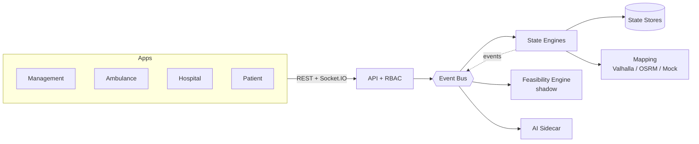
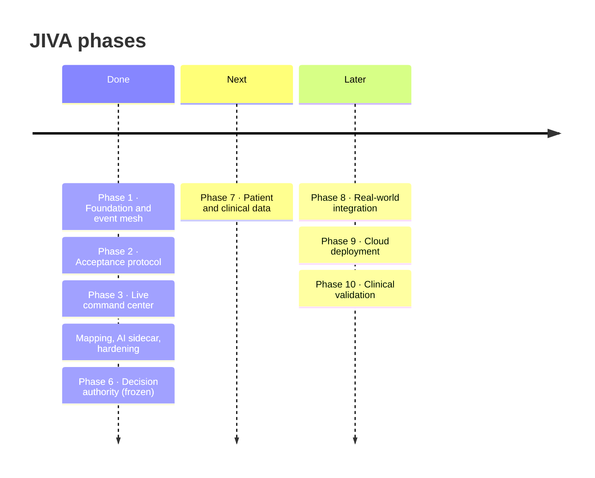

<div align="center">

# JIVA

**Privacy-preserving, real-time healthcare coordination.**
*Ambulances, hospitals, and patients on one event-driven mesh — without exposing a single hospital database.*


</div>

---

## Why JIVA

In an emergency, the nearest hospital is often not the right one. The cath lab is full, the pediatric ICU has no beds, and the ambulance finds out on arrival.

JIVA's rule is simple: **never assume a bed is open.** Public data tells us what a hospital *can* do. Only a live, time-bounded acceptance from that hospital tells us it *will*. Everything else stays `UNKNOWN`.

## Highlights

- **Event-driven core.** Every fact is an event on a central bus. State engines project events into Patient, Hospital, and Ambulance state.
- **Hospital Acceptance Protocol.** A hospital must answer a real request for a real case. Rejections and timeouts trigger automatic re-routing.
- **No inference as fact.** Every derived value carries `confidence` and `provenance`. Estimates are never presented as confirmed.
- **Care Feasibility Engine.** Checks clinical capability, evidence quality, and acceptance. It runs in **shadow mode only**.
- **Provider-agnostic routing.** Valhalla, OSRM, or a labelled synthetic fallback, chosen through a fallback chain.
- **AI sidecar.** Produces handoff briefs and timeline summaries. It emits only `ai.*` events and has no routing authority.
- **Four role-scoped apps.** Management, Ambulance, Hospital, and Patient, all updated live over Socket.IO.
- **Local-first, AWS-ready.** The same design runs in memory locally and is modeled in CDK for AWS.

## Architecture



| | Local mode | AWS mode (modeled, not deployed) |
|---|---|---|
| Event bus | in-process `EventEmitter` | Amazon EventBridge |
| API | Express | API Gateway + Lambda |
| State | in-memory maps | DynamoDB |
| Realtime | Socket.IO | API Gateway WebSocket |
| Auth | demo personas | Amazon Cognito (RS256 JWT) |
| AI | mock templates | Amazon Bedrock |

## Quick Start

Requires Node.js 20+.

```bash
npm install
npm run dev                # API :4000 + all four apps
npm run simulate:full:blr  # flagship scenario: request → accept → reroute → arrival
```

| Service | Dev | Production build |
|---|---|---|
| API | `:4000` | `:4000` |
| Management | `:5173` | `:4173` |
| Ambulance | `:5174` | `:4174` |
| Hospital | `:5175` | `:4175` |
| Patient | `:5176` | `:4176` |

`npm run start:prod` serves the production builds.

### Common commands

| Command | Purpose |
|---|---|
| `npm test` | Unit and integration suites |
| `npm run typecheck` | Build all workspaces and typecheck the tests |
| `npm run demo:reset` | Reset demo state |
| `npm run demo:check` | Verify demo readiness, including Lambda bundle loading |
| `npm run simulate:emergency` | Emit a Bengaluru emergency event sequence |
| `npm run canary:soak` | Run the authority canary soak |
| `npm run data:build` | Fetch, normalize, and validate the public dataset |
| `npm run aws:status` | Show AWS deployment status (nothing is deployed) |

> **Auth is demo-only.** Clients send `x-jiva-demo-user: <persona>` (see `packages/auth/src/demoAuth.ts`). The server enforces role scope on both REST and event submission. Demo auth is refused in production mode.

## Repository Layout

```text
jiva/
├── apps/
│   ├── management-web/    Command center: map, incidents, decision trace
│   ├── ambulance-web/     EMS view: route, destination, alternatives
│   ├── hospital-web/      ED clinician accept / limited / reject
│   └── patient-web/       Own-case journey, server ETA, uncertainty shown
├── packages/
│   ├── event-schema/      Zod definitions of canonical events
│   ├── domain-models/     Patient, Hospital, Ambulance, protocol types
│   ├── feasibility/       Care Feasibility Engine (rules, evidence, trace)
│   ├── intelligence/      AI providers: mock, Bedrock, cache
│   ├── mapping/           Routing and geocoding providers + fallback
│   ├── realtime/          Socket.IO and AWS WebSocket adapters
│   ├── auth/              Demo personas, RBAC, Cognito JWT verification
│   ├── config/            Shared runtime configuration
│   └── ui/                Shared components (MapLibre map)
├── services/api/          Express + Socket.IO + event bus + state engines
├── infrastructure/aws/    CDK stack and bundled Lambda assets
├── scripts/               Simulators, data pipeline, AWS management
├── data/                  Raw, normalized, canonical, synthetic datasets
├── tests/                 Unit and integration suites
└── docs/                  Architecture, security, runbooks, phase handoffs
```

## Current Implementation

**Legend:** ✅ implemented and tested · 🟡 implemented, not verified against the real system · ⏳ not started

### Platform

| Area | Status | Notes |
|---|---|---|
| Event schemas and ingress validation | ✅ | Zod validation, future-timestamp guard, 100 kB limit |
| Event bus and state engines | ✅ | Idempotent, ordered by watermark, isolated handlers |
| Hospital Acceptance Protocol | ✅ | Case-bound; expiry returns to `UNKNOWN` |
| Clinical eligibility | ✅ | Capability + current acceptance + not `UNAVAILABLE` |
| Dynamic re-routing | ✅ | On reject, unavailable, or expiry; flagship scenario is deterministic |
| RBAC and realtime filtering | ✅ | Per-role event filtering, verified reconnect resync |
| Demo reset | ✅ | Admin-only, with an epoch guard for in-flight work |
| Four role apps | ✅ | Verified in browser, dev and prod |

### Intelligence and data

| Area | Status | Notes |
|---|---|---|
| Mapping: mock provider | ✅ | Labelled *synthetic, no live traffic* in every UI |
| Mapping: fallback chain | ✅ | `/api/health` reports the provider that actually answered |
| Mapping: Valhalla / OSRM | 🟡 | Fixture-tested; not run against a live server |
| MapLibre + OSM tiles | ✅ | Attribution shown; tiles need internet |
| AI sidecar: mock | ✅ | Prompt-injection tested; failure never blocks the system |
| AI sidecar: Bedrock | 🟡 | Failure path only; no credentials tested |
| Care Feasibility Engine | ✅ | **Shadow-only.** It never controls routing |
| Canonical dataset | ✅ | 7 public-listed records; capabilities unknown |
| Synthetic dataset | ✅ | 4 hospitals, 3 ambulances |

### Decision authority (Phase 6)

The feasibility engine is built to be promoted to a decision-maker later, but only through a governed path:

- **Authority gate** with kill switch, circuit breaker, and promotion gates
- **Canary soak runner** and a full authority transition lifecycle simulator
- **Replay parity validator** and audit logger (SHA-256)
- **20 adversarial failure scenarios**, all passing
- **Cognito RS256 JWT verification**, with demo auth refused in production

Current state: `DECISION_AUTHORITY_MODE=SHADOW`. The legacy rule engines make every routing decision. **Human governance authorization has not been granted.**

### AWS

| Area | Status |
|---|---|
| CDK stack (EventBridge, API Gateway, Lambda, DynamoDB, Cognito, WebSocket, SQS DLQ, S3, CloudWatch) | 🟡 `cdk synth` passes |
| Lambda bundles | 🟡 Self-contained; handlers load and execute ingestion outside the repo |
| Deployment and live testing | ⏳ Nothing is deployed |

## Roadmap



### ✅ Completed

| Phase | Theme | Outcome |
|---|---|---|
| **1** | Foundation | Monorepo, event schemas, domain models, local API, first dashboard |
| **2** | Acceptance protocol | Deterministic eligibility engine, hospital accept / limited / reject, expiry handling |
| **3** | Command center | Management, ambulance, hospital, and patient apps; end-to-end simulator |
| **4–5** | Intelligence and hardening | Mapping providers, AI sidecar, RBAC, canonical data pipeline, AWS CDK, 103-check runtime suite |
| **6.1–6.7** | Decision authority | Feasibility engine (shadow), authority gate, canary soak, failure recovery, JWT verification, **foundation freeze** |

### 🔜 Next: Phase 7 — Patient & Clinical Data Foundation

Not started. It waits on explicit go-ahead.

- Patient registration and identity
- FHIR-aligned clinical data models
- EHR integration boundaries that keep hospital databases private
- Consent and privacy controls for clinical data

### 🧭 Proposed later phases

These are directional, not committed.

| Phase | Theme | Goals |
|---|---|---|
| **8** | Real-world integration | Live Valhalla / OSRM routing, live traffic, real GPS, pilot hospital acceptance channels |
| **9** | Cloud deployment | Deploy the CDK stack, verify DynamoDB conditional writes, enable Bedrock, load test, multi-region failover |
| **10** | Clinical validation | Clinical advisory sign-off, closing known constraint gaps (e.g. care-window transit), evaluating promotion to authoritative mode |

### Known limitations

- No clinical validation or physician sign-off yet.
- All operational data in the demo is synthetic; public data is facility master data only.
- AWS is synthesized but not deployed; DynamoDB behavior is unverified.
- Care-window transit constraint `HC-TMP-01` is deferred.
- Single-region design (`ap-south-1`).

## Development Rules

1. **Strict TypeScript.** No `any` unless unavoidable.
2. **Events are centralized.** New events are defined in `packages/event-schema` first.
3. **No inference as fact.** Estimates carry `confidence` and `provenance`.
4. **Local-first.** `npm run dev` must always work.

## Documentation

| Read | For |
|---|---|
| [`docs/opus-final-system-status.md`](docs/opus-final-system-status.md) | Component-by-component status |
| [`docs/architecture-diagram.md`](docs/architecture-diagram.md) | Full diagrams |
| [`docs/security.md`](docs/security.md) | Security model |
| [`docs/aws-architecture.md`](docs/aws-architecture.md) | AWS design |
| [`docs/demo-runbook.md`](docs/demo-runbook.md) | Running the demo |
| [`docs/feasibility-promotion-readiness.md`](docs/feasibility-promotion-readiness.md) | Path to authoritative mode |
| [`docs/handoffs/`](docs/handoffs) | Phase 6.1–6.7 handoffs |
| [`docs/pitch-60-seconds.md`](docs/pitch-60-seconds.md) | The pitch |

---

<div align="center">
<sub>JIVA is a research and demonstration platform. It is not a medical device and must not be used for real clinical decisions.</sub>
</div>
