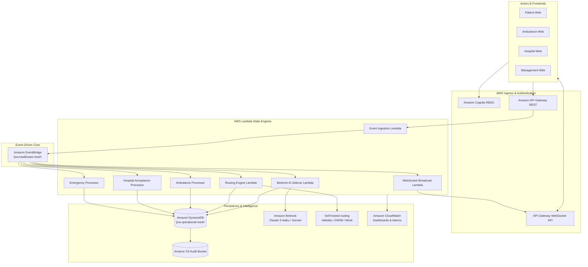
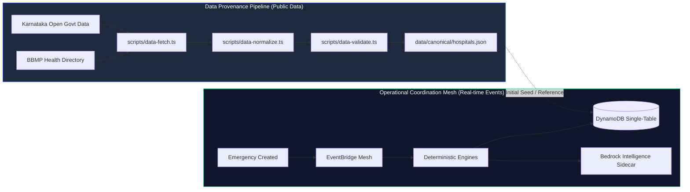

# JIVA Architecture Diagrams

## 1. End-to-End System Architecture

---

## 2. Public Data vs Operational State Pipeline Separation

**Key Architectural Invariant**: Operational events NEVER overwrite canonical public master data facts. Master facility capabilities remain grounded in verified source registries, while operational statuses (`ACCEPTED`, `LIMITED`, `UNKNOWN`) are updated strictly through cryptographic event protocols.
