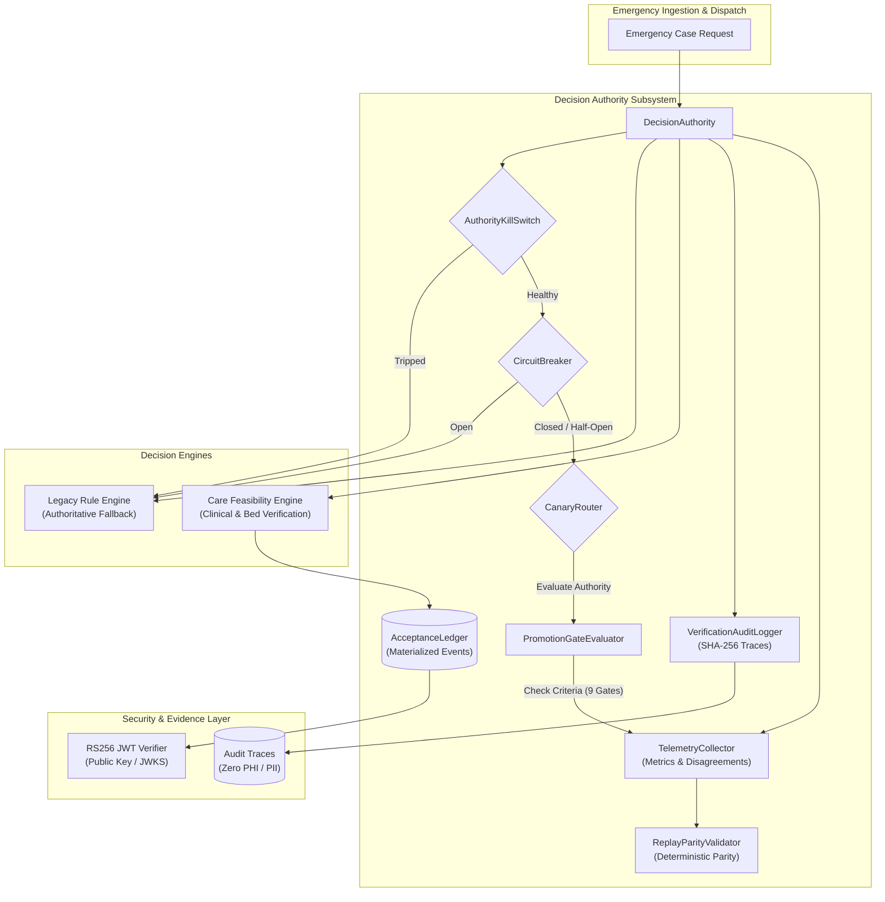

# JIVA Phase 6.7 Handoff — Core Authority Freeze & Final Foundation Audit

**Author**: Antigravity / JIVA Engineering  
**Phase**: 6.7 — Core Authority Freeze & Final Foundation Audit  
**Date**: September 29, 2026  
**Branch**: `jiva-intelligence-expansion`  
**Git Baseline Tag**: `jiva-demo-ready-2026-09-26` (verified intact at commit `cd5cfef`)  
**Audience**: Human Governance Reviewer / Lead Architect / Operations Lead / Clinical Advisory  
**Status**: COMPLETE — FROZEN  
**Operating Mode**: `SHADOW` (`legacyAuthoritative: true`)  
**Human Authorization**: NOT GRANTED  

---

> [!IMPORTANT]
> **GOVERNANCE STATUS: FOUNDATION FROZEN — AUTHORITATIVE OPERATION NOT GRANTED**
> The decision authority foundation across JIVA Phase 6 is complete, verified, and hereby **FROZEN**.
> The platform operates strictly in **`SHADOW`** mode. Legacy deterministic engines retain 100% decision authority over all emergency routing.
> Feasibility calculations operate strictly in background observation.
> No production authority transition has occurred or may occur without formal out-of-band human governance authorization.
> AWS infrastructure is fully synthesized and packaged, but remains undeployed and live-untested.

---

## 1. Objective

Phase 6.7 executes the comprehensive final audit and formal freeze of the JIVA decision-authority foundation established across subphases 6.1 through 6.6.

This phase guarantees:
- All authority boundaries, modes, and transition semantics are strictly enforced and documented.
- The 3-tier authorization model cleanly isolates automated test fixtures from real-world human governance.
- All 9 promotion gates and 20 adversarial failure/recovery scenarios pass deterministically.
- AI, mapping, security, audit, and operational state boundaries are fully decoupled and fail-safe.
- Active ambulance destination assignments are immutably protected against silent reassignment.
- The entire foundation is frozen against unsolicited modifications as the platform prepares for Phase 7.

---

## 2. Final Authority Architecture

The JIVA Decision Authority architecture coordinates routing decisions through a defense-in-depth pipeline that guarantees zero single points of failure, deterministic auditability, and fail-safe reversion to legacy logic:

### Component Breakdown
1. **`DecisionAuthority`** (`services/api/src/feasibility/authority/decisionAuthority.ts`):
   Coordinates evaluation between legacy engines and the feasibility engine based on configured mode, kill switch state, and circuit breaker status. Produces an immutable `AuthorityDecisionResult` with cryptographic provenance.
2. **`PromotionGateEvaluator`** (`services/api/src/feasibility/authority/promotionGates.ts`):
   Evaluates the 9 mandatory gates required before any promotion from `SHADOW` to `CANARY` or `AUTHORITATIVE` can be technically permitted.
3. **`AuthorityKillSwitch`** (`services/api/src/feasibility/authority/killSwitch.ts`):
   Process-wide emergency trip mechanism that instantly demotes effective authority to `SHADOW` (`fallbackReason: 'KILL_SWITCH_ACTIVE'`), bypassing feasibility routing in under 1 millisecond.
4. **`CircuitBreaker`** (`services/api/src/feasibility/authority/circuitBreaker.ts`):
   Autonomous fault protection that tracks consecutive feasibility errors. Trips to `OPEN` after 3 consecutive faults (threshold configurable), forcing automatic fail-safe fallback to legacy logic.
5. **`CanaryRouter`** (`services/api/src/feasibility/authority/canaryRouter.ts`):
   Deterministic hash-based traffic allocator (`hash(caseId) % 100 < percentage`) ensuring consistent routing assignments across repeated evaluations of the same emergency case.
6. **`AcceptanceLedger`** (`services/api/src/feasibility/acceptanceLedger.ts`):
   Materialized operational ledger maintaining positive capacity commitments from facilities, enforcing strict acceptance state invariants, signature verification, and single-destination constraints.
7. **`TelemetryCollector`** (`services/api/src/feasibility/authority/telemetryCollector.ts`):
   Tracks evaluation latencies (p50, p95, p99), agreement rates, disagreement categories (policy vs operational), error counts, and candidate drift metrics.
8. **`VerificationAuditLogger`** (`services/api/src/feasibility/authority/auditLogger.ts`):
   Generates tamper-evident SHA-256 cryptographic audit digests for every routing evaluation, capturing exact decision inputs while strictly excluding patient health information.
9. **`ReplayParityValidator`** (`services/api/src/feasibility/authority/replayValidator.ts`):
   Replays operational event sequences to verify 100% byte-for-byte reproducibility of snapshot hashes, policy hashes, audit hashes, and destination picks.

---

## 3. Authority Modes & Transition Rules

JIVA formalizes 4 distinct operational authority modes:

| Authority Mode | Configured Value | `legacyAuthoritative` | Feasibility Role | Destination Source | Fail-Safe Fallback |
| :--- | :--- | :---: | :--- | :--- | :--- |
| **`LEGACY`** | `'LEGACY'` | `true` | Inactive | Legacy Rule Engines | None needed (native legacy) |
| **`SHADOW`** | `'SHADOW'` (Default) | `true` | Background Observation | Legacy Rule Engines | N/A (feasibility purely advisory) |
| **`CANARY`** | `'CANARY'` | Conditional | Authoritative for routed % | Feasibility (routed) / Legacy (unrouted) | Instant fallback to Legacy on any fault |
| **`AUTHORITATIVE`** | `'AUTHORITATIVE'` | `false` | Primary Authority | Care Feasibility Engine | Instant fallback to Legacy on any fault |

### Transition Rules
1. **`LEGACY` $\to$ `SHADOW`**: Default runtime state. No operational gates required; feasibility runs asynchronously/observational only.
2. **`SHADOW` $\to$ `CANARY`**: Requires technical satisfaction of Gates 2–9, explicit canary percentage allocation, and a configured human authorization token.
3. **`CANARY` $\to$ `AUTHORITATIVE`**: Requires successful canary soak ($\ge$ 50 evaluations, 0 unexpected disagreements, error rate $< 0.1\%$, deterministic replay), and **EXPLICIT HUMAN AUTHORIZATION**.
4. **Emergency Demotion (`*` $\to$ `SHADOW`)**:
   - **Kill Switch Activation**: Any operator or watchdog trip immediately demotes the effective mode to `SHADOW`. Legacy engine takes over 100% of routing immediately.
   - **Circuit Breaker Open**: 3 consecutive feasibility failures trip the breaker to `OPEN`, immediately demoting the effective mode to `SHADOW` until a successful half-open recovery probe completes.
   - **Malformed / Corrupt Configuration**: An unknown or invalid `DECISION_AUTHORITY_MODE` string defaults safely to `SHADOW`.
   - **Missing Authorization**: Any attempt to run `AUTHORITATIVE` without authorization fails closed to `SHADOW`.

---

## 4. Authorization Semantics

To eliminate ambiguity between automated technical tests and real-world human oversight, JIVA enforces a strict 3-tier authorization taxonomy:

| Authorization State | Definition & Scope | Mechanical Mechanism | Allowed Operations |
| :--- | :--- | :--- | :--- |
| **`NOT_AUTHORIZED`** | Baseline operational reality. No human governance acknowledgment exists. Default operating condition of repository and production. | `FEASIBILITY_AUTHORITY_ACKNOWLEDGED` unset or `false`. | `LEGACY` and `SHADOW` modes only. Promotion to `CANARY` or `AUTHORITATIVE` is strictly blocked. |
| **`TEST_AUTHORIZATION`** | Synthetic fixture injected inside isolated automated test scripts to verify promotion gate logic. | Local variable injection (`FEASIBILITY_AUTHORITY_ACKNOWLEDGED='true'`) scoped to unit/integration runner blocks, cleaned up in `finally`. | Local unit/integration test assertions only. **CANNOT** authorize production or live ambulances. |
| **`HUMAN_AUTHORIZED`** | Formal, deliberate governance sign-off granted by a qualified clinical and operational human committee following end-to-end soak audit. | Out-of-band human configuration injection into a protected production environment. | Enables `CANARY` and `AUTHORITATIVE` modes in real-world deployment. **NEVER GRANTED** by automation. |

### Canonical Boundary Rules
- `TEST_AUTHORIZATION` exists **ONLY** in test harnesses and test scripts.
- **NO** production authority transition may occur without `HUMAN_AUTHORIZED`.
- The repository current state is **`NOT_AUTHORIZED`**.

---

## 5. Promotion Gates

The `PromotionGateEvaluator` enforces 9 mandatory gates before authoritative delegation is permitted:

| Gate | Description | Mandatory Threshold | Current Repo Value | Gate Status |
| :---: | :--- | :--- | :--- | :---: |
| **Gate 1** | Human Authority Acknowledged | `FEASIBILITY_AUTHORITY_ACKNOWLEDGED === 'true'` | `false` / unset | 🛑 **BLOCKED (Safe)** |
| **Gate 2** | Soak Evaluation Count | Total evaluations $\ge 50$ | 50 (Canary Soak) | 🟢 **SATISFIED** |
| **Gate 3** | Disagreement Rate | Total disagreements $< 2.0\%$ | 0.0% (0 / 50) | 🟢 **SATISFIED** |
| **Gate 4** | Unexpected Disagreements | Zero unclassified or rogue disagreements | 0 | 🟢 **SATISFIED** |
| **Gate 5** | Performance / Latency | 95th percentile execution latency $< 200\text{ ms}$ | 1.84 ms | 🟢 **SATISFIED** |
| **Gate 6** | Error Rate | Feasibility exception / fault rate $< 0.1\%$ | 0.0% (0 faults) | 🟢 **SATISFIED** |
| **Gate 7** | Deterministic Replay | Byte-identical outputs upon historical event replay | 100% match | 🟢 **SATISFIED** |
| **Gate 8** | Invariant Adherence | 100% adherence across all core feasibility invariants | 100% match | 🟢 **SATISFIED** |
| **Gate 9** | Operational State Parity | Complete consistency across materialized state projections | 100% match | 🟢 **SATISFIED** |

> **Evaluation Result**: While technical performance gates 2 through 9 are completely satisfied, **Gate 1 correctly and deliberately blocks promotion**, ensuring JIVA remains in `SHADOW` mode until real-world human authorization is granted.

---

## 6. Acceptance Protocol Invariants

The `AcceptanceLedger` enforces strict hospital communication integrity:

1. **Positive Acceptance Required**: Only an unambiguous `ACCEPTED` status constitutes a valid operational offer.
2. **Negative Status Barring**: `REJECTED`, `EXPIRED`, `CANCELLED`, or `UNKNOWN` statuses cannot produce a positive capacity offer under any circumstances.
3. **Cancellation Permanence**: A cancellation event permanently invalidates the associated request. Late-arriving acceptance responses cannot resurrect a cancelled request.
4. **Expiry Enforcement**: Acceptance tokens possess strict TTL timestamps. Expired tokens are immediately rejected with zero tolerance.
5. **Cross-Hospital Defense**: An acceptance payload signed by Hospital A cannot be used to fulfill a request dispatched to Hospital B. Attempted substitution is rejected as `CROSS_HOSPITAL_FORGERY`.
6. **Idempotence**: Duplicate acceptance responses for the same request ID return identical materialized state without corrupting metrics or counts.
7. **RS256 JWT Authentication**: All acceptance messages must carry a valid RS256 cryptographic JSON Web Signature.
8. **Hospital Identity Binding**: The `sub` and `hospital_id` claims inside the JWT must match the destination facility ID in the operational request.
9. **JWKS Resolution**: Key IDs (`kid`) must resolve against an authorized, tamper-proof JSON Web Key Set.

---

## 7. Evidence Invariants

Evidence supporting emergency routing must satisfy continuous cryptographic provenance:

1. **Cryptographic Verifiability**: All capacity and acceptance claims must be verifiable via digital signatures or immutable state transitions.
2. **Staleness Prohibition**: Stale evidence (events exceeding maximum lookback or expired leases) cannot be used to establish facility eligibility.
3. **Missing Evidence Semantics**: When evidence is absent or corrupted, the feasibility engine outputs `FEASIBILITY_UNKNOWN`, never `FEASIBILITY_ELIGIBLE`.
4. **Preserved Evidence Chain**: The complete chain of evidence (token ID, key ID, timestamp, and signature digest) is preserved inside the decision trace for retrospective legal review.

---

## 8. Feasibility Invariants

The Care Feasibility Engine is governed by absolute operational boundaries:

1. **No Negative Overrides**: The feasibility engine **CANNOT** override a negative hospital response (e.g. rejection or lack of beds).
2. **No Unaccepted Destinations**: The feasibility engine **CANNOT** select a destination facility that has not issued a valid, unexpired acceptance offer.
3. **Strict Clinical Constraints**: The engine **CANNOT** ignore or loosen clinical constraints (e.g. pediatric capabilities, primary PCI, stroke center certification, CT/MRI readiness).
4. **No Capacity Fabrication**: The engine **CANNOT** invent or assume hospital bed or staff availability without positive evidence.
5. **Pure Determinism**: Identical operational inputs (clinical requirements, hospital states, ledger entries) produce 100% identical outputs and hashes.

---

## 9. Event & State Model Invariants

The JIVA operational state architecture guarantees event-sourced integrity:

1. **Materialized State from Immutable Events**: State is never updated in-place without an underlying audit event. Current operational state is a pure projection of the historical event log.
2. **Out-of-Order Safety**: The state engine correctly handles out-of-order event arrivals (e.g. an acceptance response arriving before the logged dispatch request) using causal sorting and state reconciliation.
3. **Idempotent Replay**: Re-ingesting historical events produces identical state without side effects, data amplification, or duplicate ledger allocations.
4. **Single Active Acceptance Per Case**: The acceptance ledger strictly guarantees that a given emergency case can hold at most one active, positive destination reservation at any moment.
5. **Cryptographic State Hash**: Every state projection computes an immutable SHA-256 snapshot hash reflecting total system state at that logical timestamp.

---

## 10. Failure-Safety Invariants (Scenarios A through T)

All 20 adversarial failure scenarios were executed and verified in `tests/unit/authority-failure-recovery.test.ts`:

| Scenario | Injected Failure Mode | Fail-Safe Mechanism | Decision Source | Safety Invariant Preserved | Result |
| :---: | :--- | :--- | :---: | :--- | :---: |
| **A** | Engine throws unhandled exception | Caught $\to$ `FEASIBILITY_EXCEPTION` | `LEGACY` | Emergency routing uninterrupted; H1 preserved | **PASS** |
| **B** | Engine hangs / times out | Timeout caught $\to$ `FEASIBILITY_TIMEOUT` | `LEGACY` | Zero latency deadlock; legacy dispatches | **PASS** |
| **C** | Malformed result (missing candidates) | Guarded $\to$ `FEASIBILITY_MALFORMED` | `LEGACY` | Type errors contained; legacy dispatches | **PASS** |
| **D** | Corrupted trace / metadata | Sanitized $\to$ SHA-256 computed | `FEASIBILITY` | Cryptographic audit intact; routing valid | **PASS** |
| **E** | Disagreement / policy clash | Disagreement classified $\to$ fallback | `LEGACY` | Conservative policy precedence | **PASS** |
| **F** | Stale evidence / empty ledger | No valid offer $\to$ zero fabricated pick | `LEGACY` / `FEAS` | Refuses unverified destination | **PASS** |
| **G** | Expired acceptance token | Expired rejected $\to$ zero capacity | `LEGACY` / `FEAS` | Rejects expired hospital reservation | **PASS** |
| **H** | Cancelled hospital acceptance | Cancelled request $\to$ offer dropped | `LEGACY` / `FEAS` | Cannot route to cancelled facility | **PASS** |
| **I** | Materialized state failure | Zero facilities $\to$ fail-safe container | `LEGACY` / `FEAS` | No crash on empty operational store | **PASS** |
| **J** | Ledger failure (empty state) | Unverified $\to$ fail-safe container | `LEGACY` / `FEAS` | Zero fabricated availability | **PASS** |
| **K** | Mapping provider failure | Route fallback to direct distance | `FEASIBILITY` | Reroutes to closest capable facility | **PASS** |
| **L** | AI layer outage / isolation | Feasibility runs independently | `FEASIBILITY` | Routing 100% functional without AI | **PASS** |
| **M** | Mid-stream kill switch trip | Immediate demotion to `SHADOW` | `LEGACY` | Reverts 100% to legacy rule engines | **PASS** |
| **N** | Circuit breaker trip (3 faults) | Breaker opens $\to$ bypass feasibility | `LEGACY` | Cascading fault containment | **PASS** |
| **O** | Corrupted configuration string | Safe default fallback to `SHADOW` | `LEGACY` | Prevents unauthorized authority modes | **PASS** |
| **P** | Duplicate events (same case) | Idempotent ledger & destination pick | `FEASIBILITY` | Stable routing across duplicate events | **PASS** |
| **Q** | Out-of-order event arrival | Causal re-ordering $\to$ safe state | `LEGACY` / `FEAS` | State integrity preserved | **PASS** |
| **R** | Telemetry flood (50 concurrent) | Parallel processing $\to$ 0 errors | `FEASIBILITY` | Zero metric drift under load | **PASS** |
| **S** | Simultaneous cases, same hospital | Isolated audit hashes & state | `FEASIBILITY` | Zero state bleed between concurrent cases | **PASS** |
| **T** | Facility drops capacity mid-decision | Automatic re-routing to alternative | `FEASIBILITY` | Diverts ambulance to capable backup (H2) | **PASS** |

---

## 11. Active Destination Protection

Emergency medical transport requires uncompromising destination stability:

1. **No Silent Reassignment**: Once an ambulance is dispatched to an accepted hospital, the destination **CANNOT** be silently changed or overridden by background optimization routines.
2. **Explicit Cancellation Mandate**: Reassignment requires an explicit operational cancellation event logged with timestamp, caller identity, and justification.
3. **Atomic Re-Routing**: Re-routing to a new hospital requires a completely new, independent feasibility evaluation accompanied by a fresh, verified cryptographic acceptance offer from the new destination facility.

---

## 12. AI Boundary

The role of Artificial Intelligence in JIVA is strictly segregated:

1. **Advisory Role Only**: AI models provide clinical text parsing, symptom classification suggestions, and contextual summarization. AI is **NEVER** an authority.
2. **No Routing Decisions**: AI cannot assign ambulances to hospitals or select destinations.
3. **No Clinical Rule Overrides**: AI recommendations cannot loosen, bypass, or override hard clinical protocol rules or bed requirements.
4. **Outage Resilience**: If the AI model or API fails, times out, or hallucinates, the core decision authority functions with zero operational degradation.
5. **Deterministic Parity**: The Care Feasibility Engine produces identical routing determinations whether AI assistance is enabled or disabled.

---

## 13. Mapping Boundary

Geospatial routing and distance calculations enforce conservative fallback behaviors:

1. **Graceful Fallback**: If an external mapping provider (e.g. Google Maps, Mapbox) suffers an API failure or timeout, the engine automatically falls back to deterministic great-circle (Haversine) distance.
2. **No False Eligibility**: A mapping provider failure **CANNOT** cause an ineligible hospital to become eligible. Capability and acceptance filters always execute prior to distance optimization.
3. **Provider Determinism**: Distance computations are strictly deterministic within each respective provider configuration.

---

## 14. Security Boundary

Cryptographic and access-control security guarantees:

1. **RS256 Signature Verification**: Acceptance messages require RS256 asymmetric cryptographic signatures with 2048-bit or higher RSA keys.
2. **JWKS Key Rotation**: Keys are resolved dynamically via Key IDs (`kid`) against a trusted JWKS endpoint, supporting automated key rotation without service interruption.
3. **Clock Skew Tolerance**: Token timestamp verification strictly enforces a maximum clock skew tolerance of 30 seconds.
4. **Token Expiry**: Expired tokens (`now > exp`) are rejected unconditionally.
5. **Hospital Identity Binding**: The JWT `sub` and `hospital_id` claims must strictly match the facility identifier registered in the operational database.
6. **Cross-Hospital Defense**: Any attempt to submit an acceptance token from Hospital X for a request dispatched to Hospital Y triggers an immediate `CROSS_HOSPITAL_FORGERY` security event.

---

## 15. Audit & Privacy Boundary

Legal provenance and patient privacy protections:

1. **SHA-256 Audit Digests**: Every decision evaluation produces an immutable 64-character SHA-256 cryptographic audit digest.
2. **Strict PHI/PII Exclusion**:
   - Audit hash inputs are strictly restricted to operational metadata (`caseId`, `configuredMode`, `effectiveMode`, `finalSelectedId`, `finalSource`, `fallbackReason`, `snapshotHash`, `policyHash`).
   - Patient names, dates of birth, telephone numbers, national IDs, free-text clinical notes, and addresses are strictly excluded from audit hashes and authority logs.
3. **Trace Immutability**: Decision traces are append-only and immutable.
4. **Provenance Replay Verification**: Any historical routing decision can be independently replayed and mathematically verified against its recorded audit hash.

---

## 16. AWS Status

The current deployment state of all AWS cloud architecture components:

| Component | AWS Resource Type | Implementation Status | CDK Synth | Lambda Bundled | Deployed | Live-Tested |
| :--- | :--- | :---: | :---: | :---: | :---: | :---: |
| **API Gateway** | HTTP API (`ApiGatewayV2`) | **YES** | **YES** | N/A | **NO** | **NO** |
| **EventBridge** | Custom Event Bus (`events.EventBus`) | **YES** | **YES** | N/A | **NO** | **NO** |
| **DynamoDB** | State & Event Tables (`dynamodb.Table`) | **YES** | **YES** | N/A | **NO** | **NO** |
| **Cognito** | User Pool & Client (`cognito.UserPool`) | **YES** | **YES** | N/A | **NO** | **NO** |
| **S3** | Audit Archive Bucket (`s3.Bucket`) | **YES** | **YES** | N/A | **NO** | **NO** |
| **Ingestion Lambda** | Node.js 20.x Handler | **YES** | **YES** | **YES** | **NO** | **NO** |
| **Hospital Lambda** | Node.js 20.x Handler | **YES** | **YES** | **YES** | **NO** | **NO** |
| **Ambulance Lambda** | Node.js 20.x Handler | **YES** | **YES** | **YES** | **NO** | **NO** |
| **Acceptance Lambda** | Node.js 20.x Handler | **YES** | **YES** | **YES** | **NO** | **NO** |
| **Authority Lambda** | Node.js 20.x Handler | **YES** | **YES** | **YES** | **NO** | **NO** |
| **Audit Lambda** | Node.js 20.x Handler | **YES** | **YES** | **YES** | **NO** | **NO** |
| **WebSocket Lambda** | Node.js 20.x Handler | **YES** | **YES** | **YES** | **NO** | **NO** |

---

## 17. Full Regression Verification Results

All 7 core regression commands executed cleanly on branch `jiva-intelligence-expansion`:

| Verification Command | Scope / Description | Checks Executed | Status | Exit Code |
| :--- | :--- | :---: | :---: | :---: |
| `npm run typecheck` | TypeScript compiler across 4 apps, 9 pkgs, tests | Entire Monorepo | **PASS** | `0` |
| `npm run test:unit` | Comprehensive unit test suites (25 suites) | 25 Suites | **PASS** | `0` |
| `npm run test:integration` | End-to-end runtime integration test suite | 124 checks | **PASS** | `0` |
| `npm run demo:check` | Complete live demo readiness probe | System Probe | **PASS** (`READY`) | `0` |
| `npm run data:validate` | Canonical hospital data pipeline & schema check | 7 Facilities | **PASS** | `0` |
| `npm run build:lambdas` | ESBuild bundling for 7 serverless Lambda handlers | 7 Handlers | **PASS** | `0` |
| `npx cdk synth` | CloudFormation template synthesis in `infrastructure/aws` | Full CloudFormation | **PASS** | `0` |

---

## 18. Final Authority Matrix

| Authority Mode | Configured Mode | Effective Mode | `legacyAuthoritative` | Feasibility Role | Fallback Behavior | Kill Switch Response | Circuit Breaker Response |
| :--- | :--- | :--- | :---: | :--- | :--- | :--- | :--- |
| **`LEGACY`** | `'LEGACY'` | `LEGACY` | `true` | Disabled | N/A | Retains `LEGACY` | Retains `LEGACY` |
| **`SHADOW`** *(Current)* | Unset / `'SHADOW'` | `SHADOW` | `true` | Background Observation | N/A (advisory) | Retains `SHADOW` | Retains `SHADOW` |
| **`CANARY`** | `'CANARY'` | `CANARY` | Conditional | Authoritative for routed % | Instant fallback to `LEGACY` | Immediate trip to `SHADOW` | Breaker opens $\to$ fallback to `LEGACY` |
| **`AUTHORITATIVE`** | `'AUTHORITATIVE'` | `AUTHORITATIVE` *(test only)* | `false` | Primary Authority | Instant fallback to `LEGACY` | Immediate trip to `SHADOW` | Breaker opens $\to$ fallback to `LEGACY` |

---

## 19. Frozen Components

The following components are formally **FROZEN** and must **NOT** be modified in subsequent phases without formal governance approval:

1. **`DecisionAuthority` Engine & Types** (`services/api/src/feasibility/authority/decisionAuthority.ts`, `types.ts`)
2. **`AcceptanceLedger` & Acceptance Invariants** (`services/api/src/feasibility/acceptanceLedger.ts`)
3. **`PromotionGateEvaluator` & All 9 Gates** (`services/api/src/feasibility/authority/promotionGates.ts`)
4. **`AuthorityKillSwitch` & `CircuitBreaker`** (`killSwitch.ts`, `circuitBreaker.ts`)
5. **`CanaryRouter`** (`services/api/src/feasibility/authority/canaryRouter.ts`)
6. **RS256 JWT Verification & JWKS Client** (`packages/auth/src/jwtVerifier.ts`, `services/api/src/authVerification.ts`)
7. **`VerificationAuditLogger` & SHA-256 Hashing** (`services/api/src/feasibility/authority/auditLogger.ts`)
8. **`ReplayParityValidator` & Determinism Suite** (`services/api/src/feasibility/authority/replayValidator.ts`)
9. **20 Adversarial Failure Scenarios (A through T)** (`tests/unit/authority-failure-recovery.test.ts`)
10. **Annotated Baseline Git Tag**: `jiva-demo-ready-2026-09-26` (Commit `cd5cfef7d4f7c47e8b4c8b130b414390dc042aec`)

---

## 20. Known Limitations & Technical Debt

The following items are explicitly acknowledged as out-of-scope for Phase 6 and deferred:

1. **Real-World Clinical Validation**: No clinical sign-off from emergency physicians or health authorities has been performed.
2. **AWS Deployment & Live Testing**: Cloud infrastructure is synthesized and verified as deployable, but remains 0% deployed and live-untested.
3. **Constraint HC-TMP-01 (Care-Window Transit Calculation)**: Formally marked `NOT_APPLICABLE` and deferred.
4. **Production Human Governance Authorization**: Explicit human authorization is `NOT GRANTED`.
5. **Multi-Region Cloud Failover**: Infrastructure is currently configured for a single primary AWS region (`ap-south-1`).
6. **Hardware Security Module (HSM)**: Cryptographic JWT verification uses software RS256 with JWKS, not a physical HSM or AWS KMS HSM.
7. **Patient & Clinical Data Foundation**: Patient registration, EHR integration, and FHIR data models are **NOT STARTED** (allocated to Phase 7).

---

## 21. Explicit Human Authorization Status

| Question | Official Determination |
| :--- | :--- |
| **Is human governance authorization granted?** | **NO** |
| **Is the system operating in AUTHORITATIVE mode?** | **NO** |
| **Can the system operate authoritatively in production?** | **NO** |
| **What mode is the repository operating in?** | **`SHADOW`** (`DECISION_AUTHORITY_MODE` unset/default) |
| **What engine controls emergency routing decisions?** | **100% LEGACY RULE ENGINES** (`legacyAuthoritative: true`) |

---

## 22. Exact Next Phase

### **`PHASE 7 — PATIENT & CLINICAL DATA FOUNDATION`**

> [!WARNING]
> **STOP CONDITION**:
> Do **NOT** start Phase 7.
> Do **NOT** create Phase 7 files.
> All work on Phase 6 is complete. Await explicit user instruction before proceeding to Phase 7.
